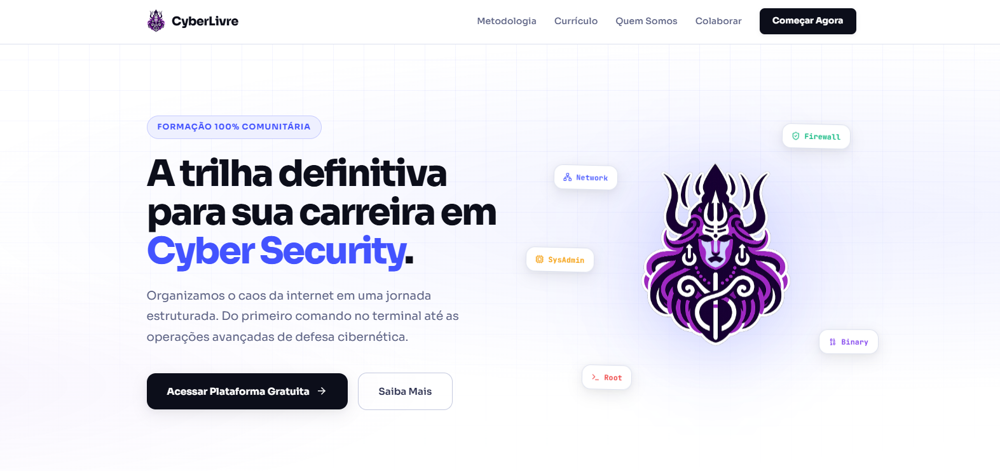

<h1 align="center">Cyberlivre</h1>

---

## O QUE É O CYBERLIVRE

O Cyberlivre é uma iniciativa de impacto social e uma plataforma open-source nascida para democratizar o ensino de cibersegurança. 

Organizamos o conhecimento da internet em uma jornada estruturada de 20 módulos práticos, que vai desde os fundamentos básicos de infraestrutura até operações avançadas de defesa cibernética e exploração. A plataforma é totalmente construída em tecnologias web padrão e funciona sem cadastros ou paywalls.

**Site:** [cyberlivre.netlify.app](https://cyberlivre.netlify.app)

---

## COMO COLABORAR

O projeto está em constante evolução e se mantém puramente através da inteligência coletiva. Toda ajuda é muito bem-vinda para manter a plataforma atualizada e com alto rigor técnico.

Você pode colaborar das seguintes formas:
- **Atualização do Currículo:** Envie Pull Requests para adicionar novos conteúdos, ferramentas modernas ou corrigir links nos módulos.
- **Criação de Desafios:** Contribua com novos laboratórios práticos e exercícios de fixação.
- **Melhorias no Código:** Ajude a otimizar a interface (HTML/CSS) ou a lógica de carregamento do currículo (Vanilla JS).

---

Feito com ❤️ pela comunidade brasileira de cibersegurança
